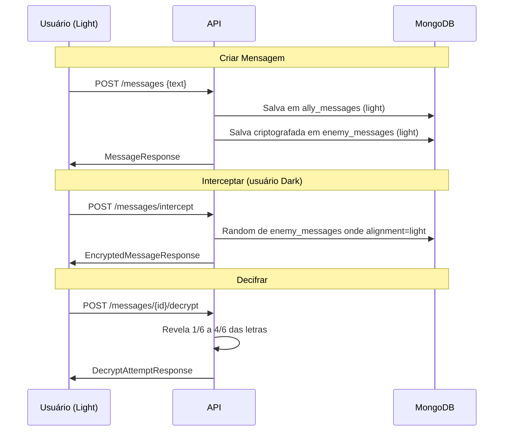

# 🌌 Star Wars API — Case Técnico Backend Python (PowerOfData)

API RESTful construída em **Python + FastAPI**, consumindo dados da **SWAPI (https://swapi.dev/)** e expondo endpoints filtráveis para consulta de informações de Star Wars.

---

## 🚀 Como Executar

### ⚙️ Configuração Inicial

Antes de executar, configure as variáveis de ambiente:

```bash
# Copie o arquivo de exemplo
cp .env.example .env

# Edite as configurações (opcional)
# nano .env
```

> ⚠️ **Importante:** Em produção, altere o `JWT_SECRET_KEY` para um valor seguro!

### Opção 1: Docker Compose (Recomendado)

```bash
# Iniciar API + MongoDB
make docker-up

# Ou manualmente
docker compose up -d

# Ver logs
make docker-logs

# Parar containers
make docker-down
```

A API estará disponível em: http://localhost:8000

### Opção 2: Execução Local

```bash
# 1. Instalar dependências
make dev
# ou: pip install -e ".[dev]"

# 2. Iniciar MongoDB (necessário)
docker run -d -p 27017:27017 --name mongo mongo:7.0

# 3. Executar a API
make run
# ou: uvicorn app.main:app --reload
```

### Comandos Disponíveis (Makefile)

| Comando | Descrição |
|---------|-----------|
| `make help` | Lista todos os comandos |
| `make dev` | Instala dependências de desenvolvimento |
| `make run` | Inicia a API localmente |
| `make test` | Executa os testes |
| `make docker-up` | Inicia com Docker Compose |
| `make docker-down` | Para os containers |
| `make docker-logs` | Visualiza logs |
| `make lint` | Executa linter (ruff) |
| `make format` | Formata código (black) |

---

## 📖 Documentação Interativa

Após iniciar a API, acesse:
- **Swagger UI:** http://localhost:8000/docs
- **ReDoc:** http://localhost:8000/redoc

---

## ✅ Requisitos do Case (atendidos)

- **Python** como linguagem principal
- Consumo de dados via **SWAPI**
- Endpoints para consulta de **filmes, personagens, planetas, espécies, naves e veículos**
- Suporte a **filtros via query params**
- Desenho preparado para deploy em **GCP** (Cloud Functions + API Gateway/Apigee)

---

## 🧱 Stack

| Tecnologia | Uso |
|------------|-----|
| Python 3.11+ | Linguagem principal |
| FastAPI | Framework web |
| Pydantic | Validação de dados |
| HTTPX | Cliente HTTP assíncrono |
| Motor | Driver MongoDB assíncrono |
| python-jose | JWT tokens |
| passlib/bcrypt | Hash de senhas |
| Pytest | Testes unitários |

---

## 🔌 API — Documentação de Rotas

### 🔐 Autenticação

| Método | Endpoint | Descrição | Auth |
|--------|----------|-----------|------|
| `POST` | `/api/v1/auth/token` | Login (retorna access + refresh tokens) | ❌ |
| `POST` | `/api/v1/auth/refresh` | Renovar tokens usando refresh token | ❌ |

**Exemplo de Login:**
```bash
curl -X POST "http://localhost:8000/api/v1/auth/token" \
  -d "username=seu_usuario&password=sua_senha"
```

**Resposta:**
```json
{
  "access_token": "eyJhbGciOiJIUzI1NiIsInR5cCI6IkpXVCJ9...",
  "refresh_token": "abc123...",
  "token_type": "bearer"
}
```

---

### 👤 Usuários

| Método | Endpoint | Descrição | Auth | Scope |
|--------|----------|-----------|------|-------|
| `POST` | `/api/v1/users` | Criar novo usuário (comum) | ❌ | - |
| `POST` | `/api/v1/users/admin` | Criar usuário administrador | ✅ | `users:admin` |
| `GET` | `/api/v1/users` | Listar todos os usuários | ✅ | `users:read` |
| `GET` | `/api/v1/users/me` | Obter usuário atual | ✅ | `users:read` |
| `GET` | `/api/v1/users/{id}` | Obter usuário por ID | ✅ | `users:read` |
| `PATCH` | `/api/v1/users/{id}` | Atualizar usuário | ✅ | `users:write` |
| `DELETE` | `/api/v1/users/{id}` | Deletar usuário | ✅ | `users:delete` |

**OAuth2 Scopes:**
| Scope | Descrição |
|-------|-----------|
| `users:read` | Leitura de informações de usuários |
| `users:write` | Modificação de informações de usuários |
| `users:delete` | Deleção de usuários |
| `users:admin` | Administração de usuários (criação de admins) |

> **Nota:** Scopes são automaticamente atribuídos ao token com base no papel do usuário:
> - Usuários comuns: `users:read`, `users:write`
> - Administradores: todos os scopes

**Campos do Usuário:**
- `alignment`: Obrigatório. Define o lado da Força (`light` ou `dark`)
- `role`: Papel do usuário (`user` ou `admin`). Administradores só podem ser criados por outros admins.

**Exemplo de Criação de Usuário:**
```bash
curl -X POST "http://localhost:8000/api/v1/users" \
  -H "Content-Type: application/json" \
  -d '{"username": "luke", "email": "luke@jedi.com", "password": "force123", "alignment": "light"}'
```

**Exemplo de Criação de Admin (requer token de admin):**
```bash
curl -X POST "http://localhost:8000/api/v1/users/admin" \
  -H "Content-Type: application/json" \
  -H "Authorization: Bearer <admin_token>" \
  -d '{"username": "vader", "email": "vader@sith.com", "password": "darkside", "alignment": "dark"}'
```


---

### 🔄 Ordenação

Todas as rotas GET que retornam listas suportam ordenação através dos parâmetros:

| Parâmetro | Descrição | Valores |
|-----------|-----------|---------|
| `sort_by` | Campo para ordenar | Varia por recurso (ver tabela abaixo) |
| `sort_order` | Direção da ordenação | `asc` (crescente), `desc` (decrescente) |

**Campos de Ordenação por Recurso:**

| Recurso | Campos Disponíveis | Padrão |
|---------|-------------------|--------|
| Films | `title`, `episode_id`, `release_date`, `director` | - |
| People | `name`, `height`, `mass`, `birth_year` | - |
| Planets | `name`, `diameter`, `population`, `rotation_period`, `orbital_period` | - |
| Species | `name`, `classification`, `language`, `average_height`, `average_lifespan` | - |
| Starships | `name`, `model`, `cost_in_credits`, `length`, `crew`, `passengers` | - |
| Vehicles | `name`, `model`, `cost_in_credits`, `length`, `crew`, `passengers` | - |
| Users | `username`, `email`, `created_at` | `created_at desc` |
| Messages | `created_at` | `created_at desc` |

**Exemplos:**
```bash
# Filmes ordenados por episódio crescente
curl "http://localhost:8000/api/v1/films?sort_by=episode_id&sort_order=asc"

# Personagens ordenados por altura decrescente
curl "http://localhost:8000/api/v1/people?sort_by=height&sort_order=desc"

# Usuários ordenados por nome crescente
curl "http://localhost:8000/api/v1/users?sort_by=username&sort_order=asc" \
  -H "Authorization: Bearer <token>"
```

> 💡 **Nota:** Quando a ordenação é ativada, os dados são buscados de todas as páginas antes de ordenar, garantindo resultados consistentes.

---

### 🎬 Filmes

| Método | Endpoint | Descrição | Filtros |
|--------|----------|-----------|---------|
| `GET` | `/api/v1/films` | Listar todos os filmes | `title`, `director_name`, `producer_name`, `character_name`, `page` |
| `GET` | `/api/v1/films/{id}` | Obter filme por ID | - |

**Filtros Disponíveis:**
- `title`: Filtrar por título (match parcial)
- `director_name`: Filtrar por nome do diretor (match parcial)
- `producer_name`: Filtrar por nome do produtor (match parcial)
- `character_name`: Filtrar por nome do personagem presente no filme (match parcial)

**Exemplo:**
```bash
# Listar filmes
curl "http://localhost:8000/api/v1/films"

# Filtrar por diretor
curl "http://localhost:8000/api/v1/films?director_name=Lucas"

# Filtrar por produtor
curl "http://localhost:8000/api/v1/films?producer_name=Kurtz"

# Filtrar por personagem (pelo nome)
curl "http://localhost:8000/api/v1/films?character_name=Luke"

# Obter filme específico
curl "http://localhost:8000/api/v1/films/1"
```

**Campos retornados:** `id`, `title`, `episode_id`, `opening_crawl`, `director`, `producer`, `release_date`, `characters`, `planets`, `starships`, `vehicles`, `species`

---

### 👥 Personagens (People)

| Método | Endpoint | Descrição | Filtros |
|--------|----------|-----------|---------|
| `GET` | `/api/v1/people` | Listar todos os personagens | `name`, `gender`, `specie`, `page` |
| `GET` | `/api/v1/people/{id}` | Obter personagem por ID | - |

**Filtros Disponíveis:**
- `name`: Filtrar por nome (match parcial)
- `gender`: Filtrar por gênero (`male`, `female`, `n/a`, `hermaphrodite`)
- `specie`: Filtrar por nome da espécie (ex: `Human`, `Droid`)

**Exemplo:**
```bash
# Buscar por nome
curl "http://localhost:8000/api/v1/people?name=luke"

# Filtrar por gênero
curl "http://localhost:8000/api/v1/people?gender=female"

# Filtrar por espécie
curl "http://localhost:8000/api/v1/people?specie=Droid"
```

**Campos retornados:** `id`, `name`, `height`, `mass`, `hair_color`, `skin_color`, `eye_color`, `birth_year`, `gender`, `homeworld`, `films`, `species`, `vehicles`, `starships`

---

### 🌍 Planetas

| Método | Endpoint | Descrição | Filtros |
|--------|----------|-----------|---------|
| `GET` | `/api/v1/planets` | Listar todos os planetas | `name`, `climate`, `terrain`, `page` |
| `GET` | `/api/v1/planets/{id}` | Obter planeta por ID | - |

**Filtros Disponíveis:**
- `name`: Filtrar por nome (match parcial)
- `climate`: Filtrar por clima (match parcial, ex: `arid`, `temperate`)
- `terrain`: Filtrar por terreno (match parcial, ex: `desert`, `mountains`)

**Exemplo:**
```bash
curl "http://localhost:8000/api/v1/planets?name=tatooine"
curl "http://localhost:8000/api/v1/planets?climate=arid"
curl "http://localhost:8000/api/v1/planets?terrain=desert"
```

**Campos retornados:** `id`, `name`, `rotation_period`, `orbital_period`, `diameter`, `climate`, `gravity`, `terrain`, `surface_water`, `population`, `residents`, `films`

---

### 👽 Espécies

| Método | Endpoint | Descrição | Filtros |
|--------|----------|-----------|---------|
| `GET` | `/api/v1/species` | Listar todas as espécies | `name`, `classification`, `language`, `page` |
| `GET` | `/api/v1/species/{id}` | Obter espécie por ID | - |

**Filtros Disponíveis:**
- `name`: Filtrar por nome (match parcial)
- `classification`: Filtrar por classificação (match parcial, ex: `mammal`, `reptile`)
- `language`: Filtrar por idioma (match parcial)

**Exemplo:**
```bash
curl "http://localhost:8000/api/v1/species?name=Human"
curl "http://localhost:8000/api/v1/species?classification=mammal"
curl "http://localhost:8000/api/v1/species?language=Galactic"
```

**Campos retornados:** `id`, `name`, `classification`, `designation`, `average_height`, `skin_colors`, `hair_colors`, `eye_colors`, `average_lifespan`, `homeworld`, `language`, `people`, `films`

---

### 🚀 Naves Estelares (Starships)

| Método | Endpoint | Descrição | Filtros |
|--------|----------|-----------|---------|
| `GET` | `/api/v1/starships` | Listar todas as naves | `name`, `model`, `manufacturer`, `starship_class`, `page` |
| `GET` | `/api/v1/starships/{id}` | Obter nave por ID | - |

**Filtros Disponíveis:**
- `name`: Filtrar por nome (match parcial)
- `model`: Filtrar por modelo (match parcial)
- `manufacturer`: Filtrar por fabricante (match parcial)
- `starship_class`: Filtrar por classe da nave (match parcial)

**Exemplo:**
```bash
curl "http://localhost:8000/api/v1/starships?name=Falcon"
curl "http://localhost:8000/api/v1/starships?manufacturer=Corellian"
curl "http://localhost:8000/api/v1/starships?starship_class=corvette"
```

**Campos retornados:** `id`, `name`, `model`, `manufacturer`, `cost_in_credits`, `length`, `max_atmosphering_speed`, `crew`, `passengers`, `cargo_capacity`, `consumables`, `hyperdrive_rating`, `MGLT`, `starship_class`, `pilots`, `films`

---

### 🚗 Veículos

| Método | Endpoint | Descrição | Filtros |
|--------|----------|-----------|---------|
| `GET` | `/api/v1/vehicles` | Listar todos os veículos | `name`, `model`, `manufacturer`, `vehicle_class`, `page` |
| `GET` | `/api/v1/vehicles/{id}` | Obter veículo por ID | - |

**Filtros Disponíveis:**
- `name`: Filtrar por nome (match parcial)
- `model`: Filtrar por modelo (match parcial)
- `manufacturer`: Filtrar por fabricante (match parcial)
- `vehicle_class`: Filtrar por classe do veículo (match parcial)

**Exemplo:**
```bash
curl "http://localhost:8000/api/v1/vehicles?name=speeder"
curl "http://localhost:8000/api/v1/vehicles?manufacturer=Incom"
curl "http://localhost:8000/api/v1/vehicles?vehicle_class=wheeled"
```

**Campos retornados:** `id`, `name`, `model`, `manufacturer`, `cost_in_credits`, `length`, `max_atmosphering_speed`, `crew`, `passengers`, `cargo_capacity`, `consumables`, `vehicle_class`, `pilots`, `films`

---

### 🕵️ Mini-Game: Mensagens Criptografadas

Um sistema de espionagem onde Resistência (Light) e Império (Dark) trocam mensagens secretas e tentam interceptar comunicações inimigas.

#### Conceito do Jogo

- **Criar mensagem**: Sua mensagem é salva visível para aliados e criptografada para inimigos
- **Ver mensagens aliadas**: Veja todas as mensagens do seu lado da Força
- **Interceptar**: Capture uma mensagem aleatória do lado inimigo (criptografada)
- **Decifrar**: Tente revelar o conteúdo — a cada tentativa, 1/6 a 4/6 das letras são reveladas

#### Rotas

| Método | Endpoint | Descrição | Auth |
|--------|----------|-----------|------|
| `POST` | `/api/v1/messages` | Criar mensagem criptografada | ✅ |
| `GET` | `/api/v1/messages` | Ver mensagens do seu lado | ✅ |
| `POST` | `/api/v1/messages/intercept` | Interceptar mensagem inimiga aleatória | ✅ |
| `POST` | `/api/v1/messages/{id}/decrypt` | Tentar decifrar mensagem | ✅ |

**Filtros de Ordenação (GET /messages):**
- `sort_by`: Campo para ordenar (`created_at`)
- `sort_order`: Direção da ordenação (`asc` ou `desc`, padrão: `desc`)

#### Exemplos de Uso

**1. Criar mensagem (usuário Light):**
```bash
curl -X POST "http://localhost:8000/api/v1/messages" \
  -H "Authorization: Bearer <token>" \
  -H "Content-Type: application/json" \
  -d '{"text": "A base secreta está em Hoth"}'
```

**Resposta:**
```json
{
  "id": "507f1f77bcf86cd799439011",
  "author_id": "user_id_here",
  "text": "A base secreta está em Hoth",
  "alignment": "light",
  "created_at": "2024-01-01T12:00:00"
}
```

**2. Ver mensagens do seu lado:**
```bash
curl "http://localhost:8000/api/v1/messages" \
  -H "Authorization: Bearer <token>"
```

**3. Interceptar mensagem inimiga (usuário Dark interceptando Light):**
```bash
curl -X POST "http://localhost:8000/api/v1/messages/intercept" \
  -H "Authorization: Bearer <dark_token>"
```

**Resposta:**
```json
{
  "id": "507f1f77bcf86cd799439011",
  "encrypted_text": "Z ozfv fvdivgz vfgz vo Slgs",
  "alignment": "light",
  "created_at": "2024-01-01T12:00:00"
}
```

**4. Tentar decifrar:**
```bash
curl -X POST "http://localhost:8000/api/v1/messages/507f1f77bcf86cd799439011/decrypt" \
  -H "Authorization: Bearer <dark_token>"
```

**Resposta:**
```json
{
  "partial_text": "_ b_s_ _ecr_t_ _s_á __ H__h",
  "is_complete": false
}
```

> 💡 **Dica:** Cada tentativa de decifrar revela entre 1/6 e 4/6 das letras aleatoriamente. Continue tentando até revelar a mensagem completa!

#### Diagrama de Fluxo



---

## ⚙️ Variáveis de Ambiente

| Variável | Padrão | Descrição |
|----------|--------|-----------|
| `MONGODB_URL` | `mongodb://localhost:27017` | URL de conexão MongoDB |
| `MONGODB_DB_NAME` | `starwars_db` | Nome do banco de dados |
| `JWT_SECRET_KEY` | - | Chave secreta para JWT (obrigatório em produção) |
| `ACCESS_TOKEN_EXPIRE_MINUTES` | `30` | Tempo de expiração do access token |
| `REFRESH_TOKEN_EXPIRE_DAYS` | `7` | Tempo de expiração do refresh token |

Você pode criar um arquivo `.env` na raiz do projeto:
```env
MONGODB_URL=mongodb://localhost:27017
MONGODB_DB_NAME=starwars_db
JWT_SECRET_KEY=sua-chave-super-secreta
```

---

## 🗂️ Arquitetura do Projeto

<details>
<summary><strong>📐 Arquitetura e organização de pastas</strong></summary>

```text
app/
├── api/
│   ├── routers/
│   │   ├── auth.py          # POST /auth/token, /auth/refresh
│   │   ├── films.py         # GET /films, /films/{id}
│   │   ├── people.py        # GET /people, /people/{id}
│   │   ├── planets.py       # GET /planets, /planets/{id}
│   │   ├── species.py       # GET /species, /species/{id}
│   │   ├── starships.py     # GET /starships, /starships/{id}
│   │   ├── vehicles.py      # GET /vehicles, /vehicles/{id}
│   │   └── user.py          # CRUD /users
│   ├── controllers/
│   └── dependencies.py      # Auth guards (get_current_user, etc.)
├── application/
│   ├── usecases/            # Casos de uso por recurso
│   └── service/
│       └── auth_service.py  # JWT & password hashing
├── domain/
│   ├── entities/            # Entidades de domínio
│   ├── repositories/        # Interfaces de repositório
│   └── errors.py
├── infrastructure/
│   ├── db/
│   │   └── database.py      # MongoDB connection (Motor)
│   ├── clients/
│   │   └── swapi_client.py  # HTTPX async client
│   └── repositories/        # Implementações MongoDB
├── schemas/                 # Pydantic models
├── core/
│   └── config.py            # Settings (pydantic-settings)
└── main.py
test/
├── conftest.py              # Fixtures & mocks
└── usecases/                # Testes por caso de uso
```

</details>

---

## 🧭 Diagramas (SVG)

<details>
<summary><strong>Rotas — Usuários (criar usuário)</strong></summary>


</details>

<details>
<summary><strong>Rotas — Usuários (criar admin)</strong></summary>


</details>

<details>
<summary><strong>Rotas — Usuários (lista)</strong></summary>


</details>

<details>
<summary><strong>Rotas — Usuários (usuário atual)</strong></summary>


</details>

<details>
<summary><strong>Rotas — Usuários (por id)</strong></summary>


</details>

<details>
<summary><strong>Rotas — Usuários (atualizar)</strong></summary>


</details>

<details>
<summary><strong>Rotas — Usuários (deletar)</strong></summary>


</details>

<details>
<summary><strong>Rotas — Filmes (lista)</strong></summary>


</details>

<details>
<summary><strong>Rotas — Filmes (por id)</strong></summary>


</details>

<details>
<summary><strong>Rotas — Personagens (lista)</strong></summary>


</details>

<details>
<summary><strong>Rotas — Personagens (por id)</strong></summary>


</details>

<details>
<summary><strong>Rotas — Planetas (lista)</strong></summary>


</details>

<details>
<summary><strong>Rotas — Planetas (por id)</strong></summary>


</details>

<details>
<summary><strong>Rotas — Espécies (lista)</strong></summary>


</details>

<details>
<summary><strong>Rotas — Espécies (por id)</strong></summary>


</details>

<details>
<summary><strong>Rotas — Starships (lista)</strong></summary>


</details>

<details>
<summary><strong>Rotas — Starships (por id)</strong></summary>


</details>

<details>
<summary><strong>Rotas — Veículos (lista)</strong></summary>


</details>

<details>
<summary><strong>Rotas — Veículos (por id)</strong></summary>


</details>

---

## 🧪 Testes

```bash
# Rodar todos os testes
make test

# Ou manualmente
pytest test/ -v
```

- **36 testes** cobrindo todos os casos de uso
- Repositórios fake/in-memory para isolamento
- Mocks para SWAPI e MongoDB

---

## 👨‍💻 Autor

Isaque Elis da Silva
