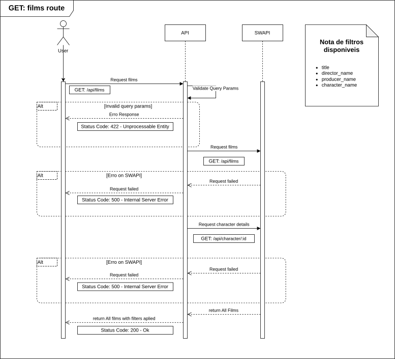
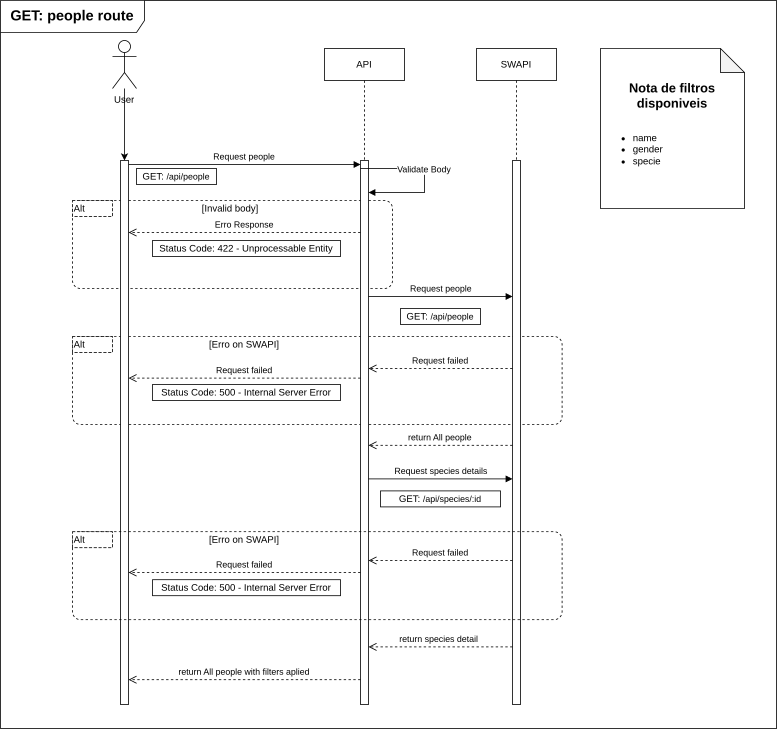
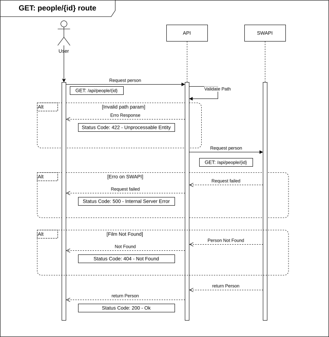
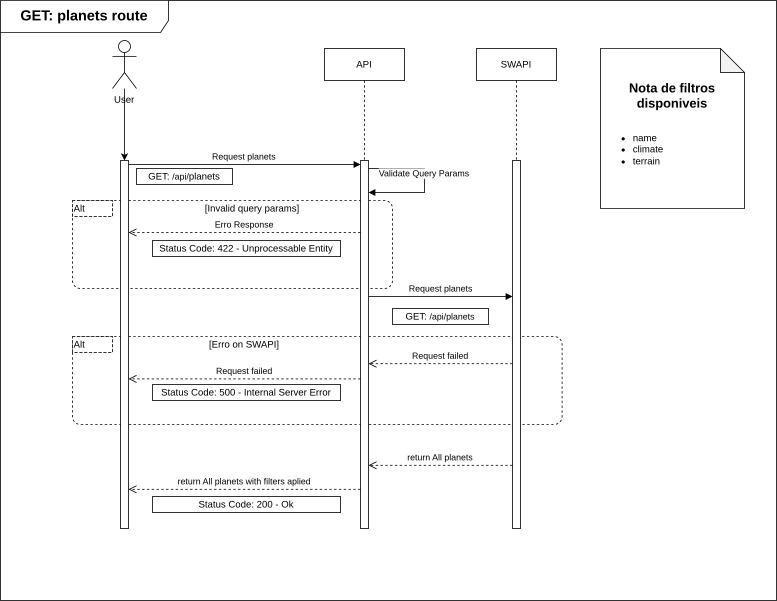
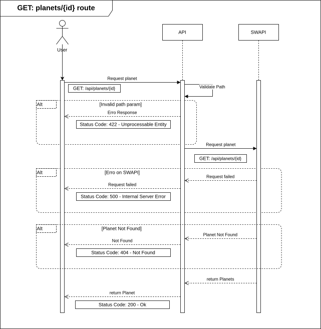
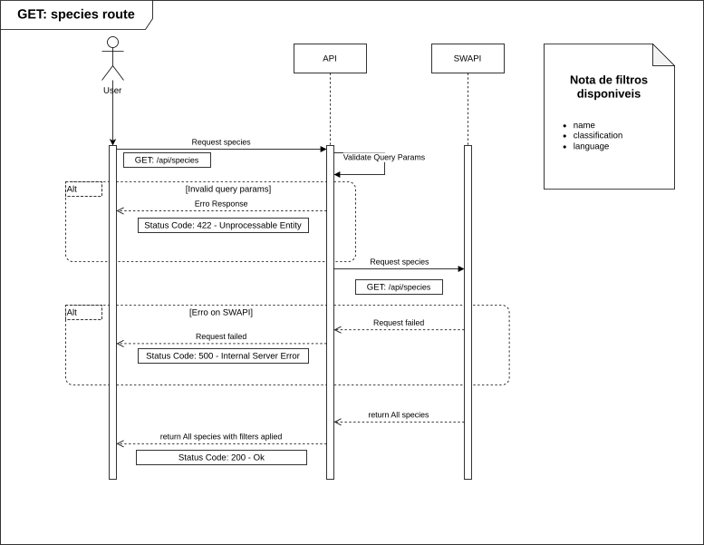
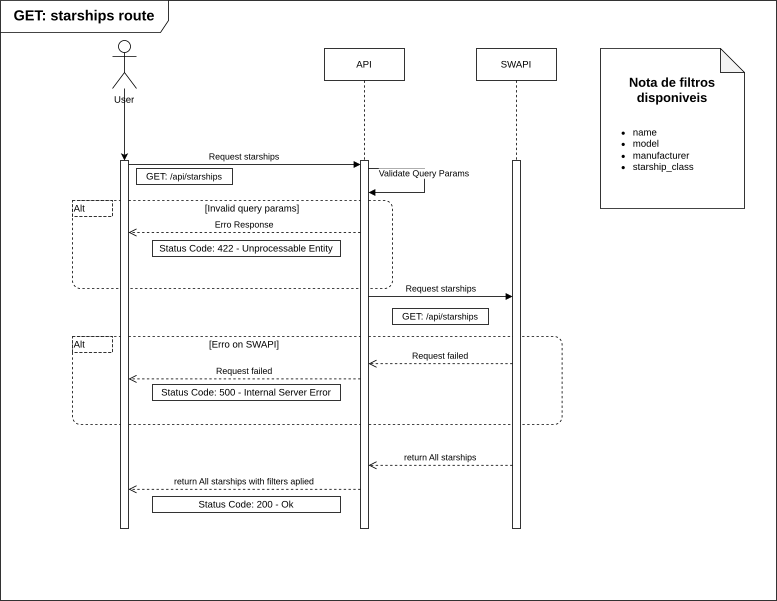
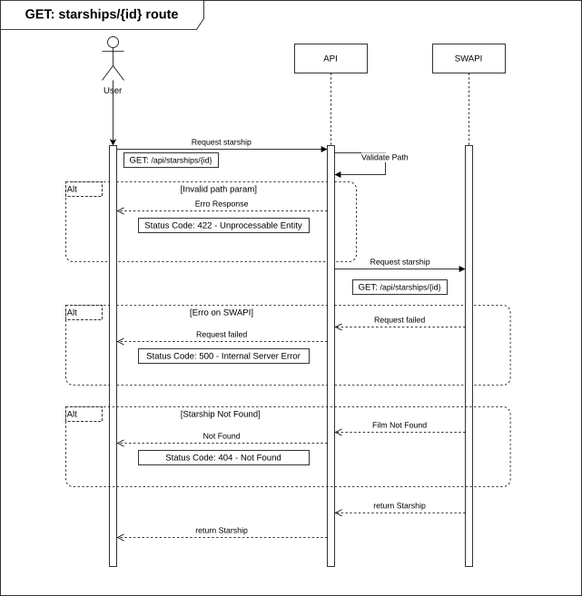
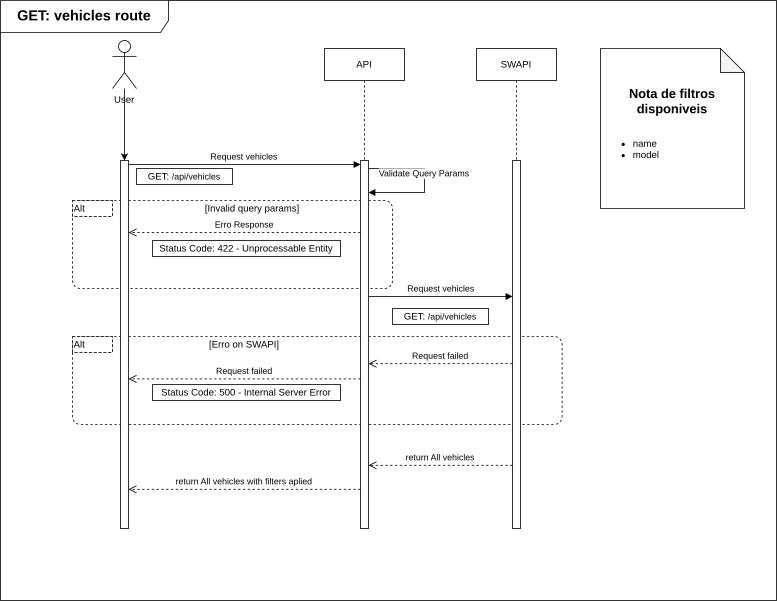
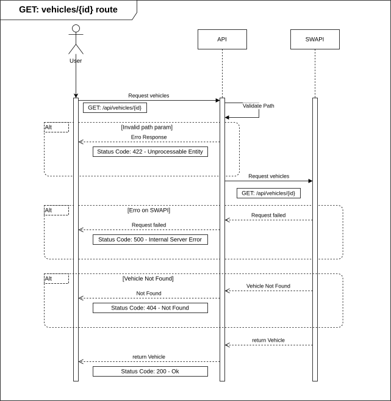

# 🌌 Star Wars API — Case Técnico Backend Python (PowerOfData)

API RESTful construída em **Python + FastAPI**, consumindo dados da **SWAPI (https://swapi.dev/)** e expondo endpoints filtráveis para consulta de informações de Star Wars.

> **Base URL (sugestão):** `/api/v1`

---

## ✅ Requisitos do Case (atendidos)

- **Python** como linguagem principal
- Consumo de dados via **SWAPI**
- Endpoints para consulta de **filmes, personagens, planetas, espécies, naves e veículos**
- Suporte a **filtros via query params**
- Desenho preparado para deploy em **GCP** (Cloud Functions + API Gateway/Apigee)

---

## 🧱 Stack

- Python 3.11+
- FastAPI
- Pydantic
- HTTPX
- Pytest
- OAuth2 + JWT (Bearer)

---

## 🗂️ Documentação

### 🏗️ Arquitetura do Projeto

<details>
<summary><strong>📐 Arquitetura e organização de pastas</strong></summary>


```text
app/
├── api/
│   ├── routers/
│   ├── controllers/
│   └── dependencies.py
├── application/
│   ├── usecases/
│   └── services/
├── domain/
│   ├── entities/
│   ├── repositories/
│   └── errors.py
├── infrastructure/
│   ├── db/
│   ├── clients/
│   └── repositories/
├── schemas/
├── core/
└── main.py
test/

```

</details>

### 🔌 API — Rotas

<details>
<summary><strong>📚 Documentação técnica de rotas</strong></summary>


- Auth: `POST /auth/token`, `POST /auth/refresh`
- Users: `GET/POST/PATCH/DELETE /users`
- SWAPI Proxy: `GET /films`, `GET /films/{id}`, etc.

</details>

---

## 🧭 Diagramas (SVG)


<details>
<summary><strong>Rotas — Filmes (lista)</strong></summary>



</details>

<details>
<summary><strong>Rotas — Filmes (por id)</strong></summary>


</details>

<details>
<summary><strong>Rotas — Personagens (lista)</strong></summary>



</details>

<details>
<summary><strong>Rotas — Personagens (por id)</strong></summary>



</details>

<details>
<summary><strong>Rotas — Planetas (lista)</strong></summary>



</details>

<details>
<summary><strong>Rotas — Planetas (por id)</strong></summary>



</details>

<details>
<summary><strong>Rotas — Espécies (lista)</strong></summary>



</details>

<details>
<summary><strong>Rotas — Espécies (por id)</strong></summary>


</details>

<details>
<summary><strong>Rotas — Starships (lista)</strong></summary>



</details>

<details>
<summary><strong>Rotas — Starships (por id)</strong></summary>



</details>

<details>
<summary><strong>Rotas — Veículos (lista)</strong></summary>



</details>

<details>
<summary><strong>Rotas — Veículos (por id)</strong></summary>



</details>

---

## 🧪 Testes

- Testes unitários por caso de uso (camada `application/`)
- Repositórios fake/in-memory para isolamento
- Execução via `pytest`

---

## 👨‍💻 Autor

Isaque Elis da Silva
